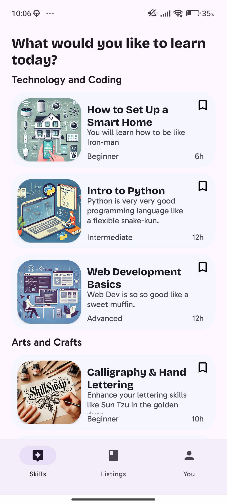
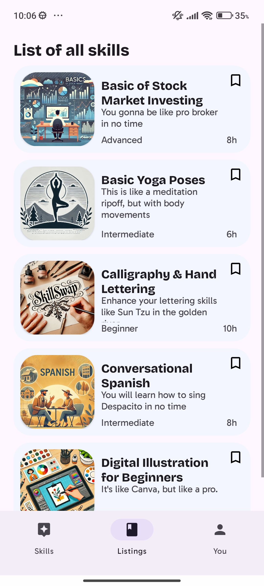
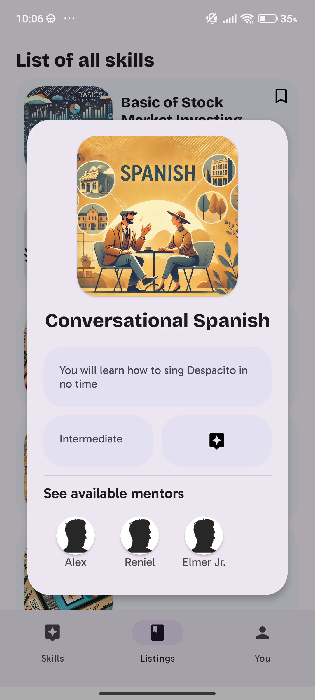
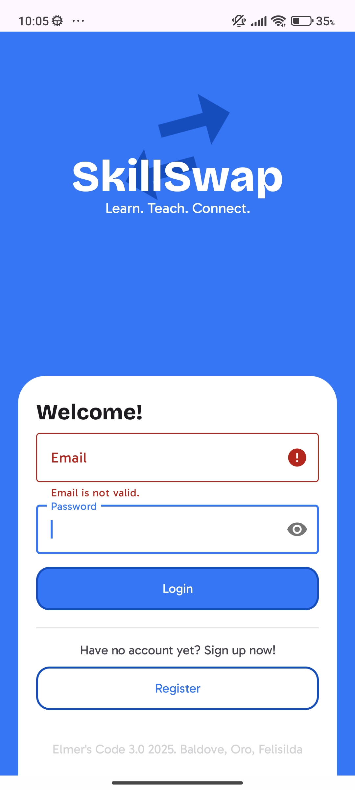

# SkillSwap

SkillSwap is an Android application that demonstrates a simple skill-sharing marketplace where users can browse skills, register as mentors, bookmark skills, and request sessions. The project is written in Java and uses a local SQLite database for persistence. This README provides an overview, setup instructions, and notes about known issues and suggested fixes.

---

## Table of contents

- [Features](#features)
- [Screenshots](#screenshots)
- [Tech stack](#tech-stack)
- [Requirements](#requirements)
- [Quick start](#quick-start)
- [Project structure (important files)](#project-structure-important-files)
- [Database schema](#database-schema)
- [Known issues & suggested fixes](#known-issues--suggested-fixes)
- [Running tests](#running-tests)
- [Contributing](#contributing)
- [License & contact](#license--contact)

---

## Features

- Browse categorized skills (Technology & Coding, Arts & Crafts, Fitness & Wellness, Business & Finance, Language & Communication)
- Bookmark favorite skills
- Register users / mentors
- Simple local persistence using SQLite (Users, Skills, Bookmarks)
- Example data initialization for quick testing

---

## Screenshots

Skill detail dialog / modal showing "Conversational Spanish" skill with mentors list.

<p align="center"> 
   
</p>

Listings view — list of all skills (stock market, yoga, calligraphy, conversational Spanish, etc.)

<p align="center"> 
   
</p>

Category view ("What would you like to learn today?") showing Technology & Coding and Arts & Crafts sections.
  
<p align="center"> 
   
</p>

Login screen with validation error message ("Email is not valid.").
  
<p align="center"> 
   
</p>

---

## Tech stack

- Android (Java)
- SQLite (via SQLiteOpenHelper)
- AndroidX + Material components

---

## Requirements

- Android Studio (recommended)
- JDK (as required by your Android Studio setup)
- Android SDK (match project's compileSdkVersion / targetSdkVersion)

---

## Quick start

1. Clone the repository
   ```
   git clone https://github.com/reniel905/SkillSwap.git
   ```
2. Open the project in Android Studio
3. Let Gradle sync and install required SDK components
4. Build and run on an emulator or device

If your repository uses a different default branch name (for example `main` vs `master`), ensure you're on the correct branch:
```
git checkout <default-branch>
```

To add this README locally and push it to the repository:
```
# create README.md with the contents of this file (or copy/paste)
git add README.md
git commit -m "Add README.md"
git push origin <your-branch>
# If you need to create/push to main:
git push origin HEAD:main
```

---

## Project structure (important files)

- app/src/main/java/com/example/skillswap
  - `SkillSwap.java` — Application subclass that initializes data and loads mentors from the local database
- app/src/main/java/com/example/skillswap/models
  - `Mentor.java`, `Skill.java`, `Credential.java`, `Session.java`
- app/src/main/java/com/example/skillswap/repo
  - `Data.java` — In-memory lists and demo data initialization (`skillsInit()`, `accountsInit()`)
  - `DatabaseHelper.java` — SQLiteOpenHelper with helper methods (insertUser, insertSkill, insertBookmark, getAllUsers, updateUser, etc.)
- app/src/main/java/com/example/skillswap/ui
  - `fragments` — UI fragments (register, login, browsing)
  - `adapters` — RecyclerView adapters (TechnologyAndCodingAdapter, FitnessAndWellnessAdapter, ArtsAndCraftAdapter, ...)
- app/src/main/java/com/example/skillswap/logic
  - `Validator.java`, `Favorites.java`, `Categorizer.java` (if present)
- app/src/main/res
  - `drawable` — image assets used for skill thumbnails
  - `layout` — XML layout files for activities/fragments/items

---

## Database

`DatabaseHelper` creates these tables (as defined in code):

- Users: `user_id, first_name, last_name, middle_name, email, phone, password`
- Skills: `skill_id, skill_name, skill_description, skill_level, skill_catergory, skill_time`
- Bookmarks: `bookmark_id, user_id, cat_id, skill_id` — intended to reference Users and Skills

---

## Known issues & suggested fixes

While exploring the code, several issues and inconsistencies were identified. Below are notes and suggested fixes to improve correctness and robustness.

1. Database table creation / column types
   - Problem: `CREATE_SKILL_TABLE` missing a type for `skill_description` (it should be TEXT).
   - Suggested fix:
     ```sql
     CREATE TABLE Skills (
       skill_id INTEGER PRIMARY KEY AUTOINCREMENT,
       skill_name TEXT,
       skill_description TEXT,
       skill_level TEXT,
       skill_catergory TEXT,
       skill_time INTEGER
     )
     ```

2. `onUpgrade` DROP TABLE syntax
   - Problem: `db.execSQL("DROP TABLE " + USER_TABLE + " IF EXISTS");` — incorrect order of `IF EXISTS`.
   - Suggested fix:
     ```java
     db.execSQL("DROP TABLE IF EXISTS " + USER_TABLE);
     db.execSQL("DROP TABLE IF EXISTS " + SKILL_TABLE);
     db.execSQL("DROP TABLE IF EXISTS " + BOOKMARK_TABLE);
     onCreate(db);
     ```

3. `insertBookmark` / Bookmark table columns mismatch
   - Problem: `insertBookmark` inserts `skill_name` into `Bookmarks` table but schema expects `skill_id`. Also `cat_id` column presence suggests categories table but none exists.
   - Suggested fix: Change `insertBookmark` to insert `skill_id` and `cat_id` when available:
     ```java
     ContentValues cv = new ContentValues();
     cv.put("user_id", userId);
     cv.put("skill_id", skillId); // integer id of Skill
     // cv.put("cat_id", categoryId); // if applicable
     db.insert(BOOKMARK_TABLE, null, cv);
     ```

4. `getBookMarksByUserId` SQL is invalid
   - Problem: Query uses `INNER JOIN Bookmarks ON Users.user_id = Bookmarks.user_id` and then `INNER JOIN Bookmarks ON Skills.skill_id = skill_id` — joins the `Bookmarks` table to itself and references `Categories` without a `Categories` table.
   - Suggested fix: Join Users -> Bookmarks -> Skills (and Categories if implemented). Example:
     ```sql
     SELECT Users.first_name, Users.last_name, Skills.skill_name
     FROM Bookmarks
     INNER JOIN Users ON Users.user_id = Bookmarks.user_id
     INNER JOIN Skills ON Skills.skill_id = Bookmarks.skill_id
     WHERE Users.user_id = ?
     ```

5. `updateUser` return value correctness
   - Problem: `return rowAffected < 0;` — should return true if rows were affected.
   - Suggested fix:
     ```java
     return rowAffected > 0;
     ```

6. `Validator` issues
   - Email validation uses `Pattern.matches(String.valueOf(Patterns.EMAIL_ADDRESS), email)` — `Patterns.EMAIL_ADDRESS` is already a Pattern. Use `Patterns.EMAIL_ADDRESS.matcher(email).matches()`.
   - `isPasswordMatched` uses `password.matches(confirmPassword)` — this interprets confirmPassword as a regex. Use `password.equals(confirmPassword)`.
   - Suggested replacements:
     ```java
     public static boolean isEmailCorrect(String email){
         return Patterns.EMAIL_ADDRESS.matcher(email).matches();
     }

     public static boolean isPasswordMatched(String password, String confirmPassword){
         return password.equals(confirmPassword);
     }
     ```

7. Null / resource safety & lifecycle
   - Consider closing Cursors after use and checking for nulls.
   - Use try/finally or try-with-resources where applicable (API permitting).
   - Example:
     ```java
     Cursor cursor = null;
     try {
       cursor = dbHelper.getAllUsers();
       while (cursor != null && cursor.moveToNext()) {
         // ...
       }
     } finally {
       if (cursor != null) cursor.close();
     }
     ```

8. Password storage
   - Storing raw passwords in a local DB (`password TEXT`) is insecure. Consider hashing passwords before storing (even for a demo app) or using Android AccountManager / secure storage for credentials.

---

## Running tests

There is a simple unit test in:
- `app/src/test/java/com/example/skillswap/ExampleUnitTest.java` — basic assertion (2 + 2 = 4)

Run unit tests through Android Studio.

---

## Contributing

Contributions are welcome. Suggested improvements:
- Fix database schema & SQL issues listed above.
- Improve form validation and error handling.
- Hash or otherwise secure password storage.
- Add migrations for database upgrades (use versioning and ALTER TABLE).
- Add network-backed storage or remote sync.
- Improve UI polish and accessibility.

If you want me to open issues or create patches for specific items above, tell me which ones and I can prepare suggested diffs/patch text.

---

## License & contact

For questions or suggestions, contact the repository owner: https://github.com/reniel905
